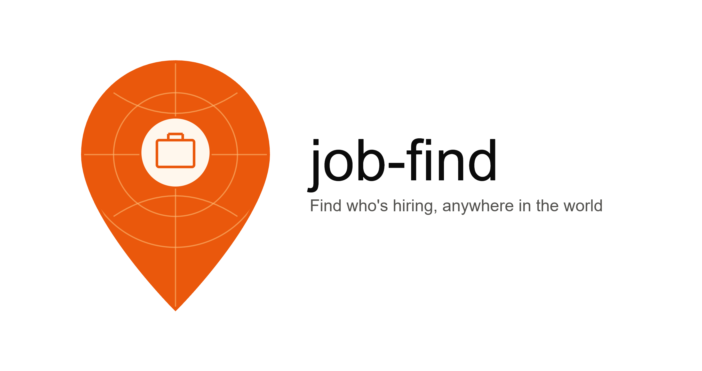

<div align="center">



# job-find

**A worldwide, map-based job discovery platform.**

Instead of scrolling a list, explore a live world map where each pin is a company office — click a pin, see every open role there.

   

**Live domain:** [`job-find.xyz`](https://job-find.xyz)

</div>

---

## 1. Product Concept

- **Map-first job search.** Google Maps as the primary interface, not a list with a small map widget bolted on.
- **Pins = offices, not jobs.** One company can have multiple offices worldwide, each its own pin. A pin with 4 open roles shows one marker, not four.
- **Worldwide from day one**, phased in by data source coverage (see §4).
- **Filterable**: title/keyword, skill, industry, experience level, remote/onsite/hybrid, salary range (final filter list still being scoped — see §9).

### Why map-first is harder than list-first
A job board list just paginates. A map has to solve: geocoding (turning "Bengaluru, India" into coordinates), clustering (10,000 pins on a world view is unreadable without grouping), and cost control (every map load and every geocode call has a price attached at scale). Those three constraints shape almost every architecture decision below.

---

## 2. Data Model

The core relationship — this is the single most important design decision in the whole project, because it's what makes this "a map of offices with jobs inside" rather than "a map with one pin per job post":

```
Company
 └── Office                    ← THE MAP PIN
      • lat / lng (geocoded, cached)
      • city, country
      • address (optional)
      └── Job[]
           • title
           • skills[]
           • experience_level
           • work_type (remote | onsite | hybrid)
           • salary_range (optional, source-dependent)
           • posted_date
           • source (adzuna | jooble | remotive | self-posted | scraped)
           • source_url
           • dedup_hash
```

**Why a `dedup_hash`:** the same job posting frequently appears on multiple job boards simultaneously. Without a fingerprint (e.g. hash of `company + title + location`, normalized), you'd double-count the same opening as two separate jobs under the same office.

---

## 3. System Architecture

```
                    ┌─────────────────────┐
                    │   Job Board APIs     │  (Adzuna, Jooble, Remotive, RemoteOK)
                    └──────────┬───────────┘
                               │  scheduled pull
                               ▼
                    ┌─────────────────────┐
                    │  Ingestion Service    │  normalizes → Company/Office/Job shape
                    │  (background workers) │  dedups, geocodes new locations
                    └──────────┬───────────┘
                               │
                               ▼
                    ┌─────────────────────┐
                    │  Postgres + PostGIS   │  geo-indexed storage
                    └──────────┬───────────┘
                               │
                               ▼
                    ┌─────────────────────┐
                    │     API Layer         │  /pins?skill=react&remote=true
                    │  (filtering, rate     │
                    │   limiting, caching)  │
                    └──────────┬───────────┘
                               │
                               ▼
                    ┌─────────────────────┐
                    │     Frontend          │  Google Maps JS API
                    │  (map + clustering +  │
                    │   filter sidebar)     │
                    └─────────────────────┘

     Phase 2 addition: Company Dashboard (auth) → writes directly into
     the same Office/Job tables, bypassing ingestion entirely.
```

### Components

1. **Ingestion Service** — scheduled (cron/queue) pulls from each job API, normalizes payloads into the shared schema, computes `dedup_hash`, and hands off new/changed locations to geocoding.
2. **Geocoding step** — converts a location string to lat/lng **once per unique location**, then caches it permanently. This is a top cost-control measure: without caching, every sync re-geocodes every job, which is both wasteful and slow.
3. **Database — Postgres with PostGIS** — chosen specifically (over plain Postgres or a NoSQL store) because geo-queries like "office pins within this map viewport" or "jobs within X km of Y" are native, indexed operations in PostGIS rather than something you'd hand-roll.
4. **API layer** — the only thing the frontend talks to. Handles filtering, pagination, response caching, and rate limiting so the frontend never calls job-board APIs or the DB directly.
5. **Frontend** — Google Maps JS API with **marker clustering** (non-negotiable — see §7) plus a filter sidebar that re-queries the API layer.
6. **Company Dashboard** *(Phase 2)* — authenticated portal where companies manage their own office pins and job listings directly, writing into the same tables the ingestion service populates.

---

## 4. Data Sources — Phased Rollout

Building "worldwide, scrape every site" as v1 is the single fastest way to stall this project before anything ships. Coverage is expanded in three deliberate phases instead:

| Phase | Source | Status | Why this order |
|---|---|---|---|
| **1** | Job board APIs — Adzuna, Jooble, Remotive, RemoteOK | Build first | Legal, fast, already-structured worldwide data. Gets a real working product live before any scraping complexity is introduced. |
| **2** | Company self-posting via dashboard | Build second | Turns the product from an aggregator into a real platform; gives companies a reason to keep coming back and keeps listings fresh without relying on third parties. |
| **3** | Scraping individual career pages | Build last, case-by-case | Only for companies not covered by any API. Each target site needs its own ToS/`robots.txt` check and its own parser — treat this as ongoing maintenance work, not a one-time build. |

---

## 5. Tech Stack

| Layer | Choice | Notes |
|---|---|---|
| Map | **Google Maps JS API** | Best UI/dev ecosystem; **not free at scale** — see §6. Requires a billing-enabled Google Cloud project even to use the free tier. |
| Marker clustering | MarkerClusterer (Google's official library) | Required — see §7. |
| Backend/API | **Go** (`chi` router + `pgx` for Postgres) | Confirmed. Chosen for solid, concurrent handling of ingestion (many job APIs + geocoding calls in parallel). |
| Database | Postgres + PostGIS | |
| Background jobs | **Asynq** (Go, Redis-backed) | Confirmed. Go equivalent of BullMQ. Ingestion must run off the request path. |
| Hosting | AWS (leveraging existing $100 credit) | See §6 for how far this stretches. |
| Domain | `job-find.xyz` | Already purchased. |

---

## 6. Cost Breakdown

### Phase 1 — build + personal/dev testing
| Item | Cost |
|---|---|
| Adzuna / Jooble / Remotive / RemoteOK APIs | Free tier |
| Postgres + PostGIS | Free (AWS credit — RDS free tier or Postgres on a t3.micro) |
| Backend hosting | Free (AWS credit) |
| Geocoding (Google) | Free tier covers dev-scale usage; caching keeps repeat costs at ~zero |
| Google Maps JS API | Free under the $200/month Google Cloud credit at low traffic |
| Domain | Already purchased |

**Total for this phase: effectively $0, comfortably covered by the $100 AWS credit.**

### Phase 2 — public launch, real traffic
Cost here scales with **usage**, not code, so it's a range rather than a fixed number:

| Driver | What pushes it up |
|---|---|
| Google Maps loads | Exceeding the $200/month free credit once daily map loads climb into the thousands |
| Geocoding | Grows with unique office locations, but caching keeps this small relative to traffic |
| Database | AWS RDS costs once past free tier — driven by data volume + query load |
| Job API limits | Free tiers cap daily calls; sustained ingestion volume may require paid tiers |
| Compute | Scales with concurrent users |

Realistic range once there's real public traffic: **roughly $20–100+/month**, genuinely dependent on actual usage patterns rather than something predictable in advance.

### Before writing any code that touches Google Maps
**Set a Google Cloud budget alert** (e.g. tripwires at $50 / $150 / $190) so a spend spike surfaces as an email, not a surprise invoice. Five-minute setup, treat as mandatory.

---

## 7. Production Non-Negotiables

These aren't nice-to-haves — each one addresses a failure mode that shows up specifically *because* this is a worldwide map product, not a regular CRUD app:

- **Marker clustering** — raw pins at world-map zoom with any real volume of listings is unusable; clustering is required, not optional polish.
- **Caching** — of geocoding results and Maps usage specifically, since both are metered cost drivers.
- **Rate limiting** on the API layer — protects both your own infra and your job-API quotas from being exhausted by abusive or runaway frontend traffic.
- **Background job queue for ingestion** — API syncs must never block user-facing requests.
- **Dedup logic** — via `dedup_hash` (see §2) — prevents the same posting from a company appearing as duplicate pins/jobs when it's listed on multiple job boards.

---

## 8. Roadmap Snapshot

- [ ] Finalize filter list (see §9)
- [x] Backend/frontend stack confirmed: Go (chi + pgx) + Postgres/PostGIS + Asynq + Next.js frontend
- [x] Phase 1: Adzuna ingestion → normalized Company/Office/Job schema → geocoding cache → basic `/pins` API
- [x] Marker clustering + filter sidebar on top of `/pins`
- [ ] AWS + Google Cloud billing alerts configured
- [x] Phase 2: Company auth + self-serve dashboard
- [ ] Phase 3: Targeted career-page scraping for API-uncovered companies

> **Implementation status:** Phases 1 and 2 are built. The ingestion pipeline
> (RemoteOK, Remotive, Adzuna, Jooble → normalize → dedup → geocode → upsert),
> the full filtered `/pins` API with PostGIS viewport queries, marker
> clustering, the filter sidebar, and the authenticated company dashboard are
> all implemented and tested. See §10 to run it, and `docs/architecture.md`
> for the implementation-level map.

---

## 9. Open Decisions

- **Final filter set** — current candidates are keyword/title, skill, industry, experience level, work type, salary range; not yet locked.
- **Build starting point** — proposed order is Adzuna ingestion → DB schema → pin API, before any map UI work begins.

---

## 10. Getting Started

### Prerequisites
- **Go** 1.22+ and **Node** 18+ (for local dev), or just **Docker** for the full stack.
- No API keys required to start: the map uses MapLibre (keyless) and data comes from RemoteOK + Remotive (keyless). Adzuna/Jooble/Google are optional and enabled only when their keys are set.

### Option A — full stack with Docker (simplest)
```bash
cp .env.example backend/.env          # optional: add API keys
docker compose up --build             # postgres, redis, api, ingest, frontend
# then seed some data:
docker compose run --rm ingest once
```
Open http://localhost:3000.

### Option B — run the pieces locally
```bash
# 1. Start the backing stores
docker compose up -d postgres redis

# 2. Backend (applies migrations on boot)
cd backend
cp ../.env.example .env
go run ./cmd/api                       # API on :8080

# 3. Seed data (one-shot ingestion pass), in another shell
go run ./cmd/ingest once

# 4. Frontend, in another shell
cd frontend
cp .env.local.example .env.local
npm install && npm run dev             # UI on :3000
```

### Tests
```bash
cd backend && go test ./...
```

> **First build:** `go.sum` is generated automatically the first time you run
> `go build`, `go run`, `go test`, or `make tidy` in `backend/` (Go fetches and
> records dependency checksums). This is normal Go behavior — no manual step.

---

## 11. API Reference

All endpoints are under `/api`. Read endpoints are public and cached; write
endpoints require a `Bearer` JWT from register/login.

| Method | Path                      | Auth | Purpose                                        |
|--------|---------------------------|------|------------------------------------------------|
| GET    | `/health`                 | —    | Liveness + DB ping.                            |
| GET    | `/api/pins`               | —    | Map pins for a viewport + filters. See params. |
| GET    | `/api/offices/{id}`       | —    | One office with its matching jobs (pin click). |
| GET    | `/api/stats`              | —    | Aggregate counts (companies/offices/jobs).     |
| GET    | `/api/skills`             | —    | Most common skills, for the filter UI.         |
| GET    | `/api/companies`          | —    | List companies.                                |
| GET    | `/api/companies/{id}`     | —    | One company.                                   |
| POST   | `/api/auth/register`      | —    | Create account (+ optional company).           |
| POST   | `/api/auth/login`         | —    | Sign in → JWT.                                 |
| GET    | `/api/auth/me`            | JWT  | Current session claims.                        |
| POST   | `/api/dashboard/offices`  | JWT  | Add an office pin (server geocodes).           |
| POST   | `/api/dashboard/jobs`     | JWT  | Post a role at your office.                     |
| DELETE | `/api/dashboard/jobs/{id}`| JWT  | Remove one of your roles.                       |

**`/api/pins` query params:** `bbox=minLng,minLat,maxLng,maxLat`, `keyword`,
`skills=a,b,c` (job must have all), `work_type=remote,onsite,hybrid`,
`experience`, `salary_min`, `salary_max`, `source`, `company`, `limit`.